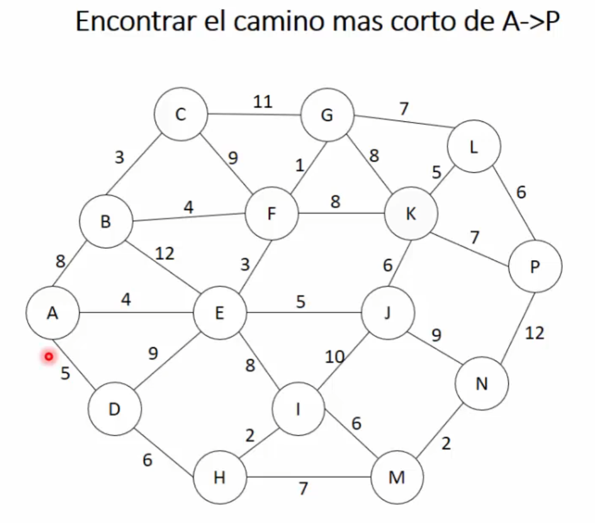

This repository is part of one of the bootcamps I decided to take after rediscovering programming—a passion I’ve had since I was a kid but had to put on hold due to various circumstances and needs. This happened shortly after graduating as a University Technician in Programming from UTN Mendoza (just to share a bit about myself).

The bootcamp is "Algoritmos y Estructuras de Datos" from the platform Código Facilito: https://codigofacilito.com/.

This README will be like a travel guide for sailors. I'll document parts of the process, include clarifications, and—given my love for explaining concepts when I find a good explanation for something, especially when it was complex to learn—I’ll share my own explanations. My goal is to distill the understanding I’ve worked hard to achieve into clear and accessible insights.

For every exercise, I analyze all the possible ways to arrive at a solution to thoroughly understand not only the exercise itself but also the underlying concepts of recursion, memoization, the iterative approach, approximation algorithms, etc. Sometimes, it’s straightforward, while other times, it’s a challenging journey that can take up to two weeks to fully grasp a concept (and yes, I still have some doubts xD).

The foundation of every explanation here comes from a process I developed after each Código Facilito class. It involves gathering information from diverse sources: videos, texts, incredible books like Grokking Algorithms or Introduction to Algorithms, trial and error on a large board, and finally, leveraging the power of AI tools. I enjoy working with AI tools because they help me organize the sometimes chaotic ideas in my brain into clear, structured explanations. However, I also believe that truly understanding the deeper workings and structure of concepts is essential. AI is an amazing tool for organizing and enhancing what you already know but not a substitute for foundational understanding.

This repository will serve as a personal reference for myself in the future, as well as a space to complete the exercises proposed in each class. My usual approach is to solve the exercises on my own first and then review the instructor’s solutions. I’ll also share parts of my learning process, including insights I gained from exploring a wide range of sources. From popular videos with thousands of views to obscure YouTubers with fewer than 15 followers who demonstrate their passion and brilliance, I’ve drawn inspiration from a variety of voices.

I hope these explanations help you better understand each process. If you need a more detailed or visual explanation, please don’t hesitate to reach out—it would be a pleasure! You can contact me at pablozaviok@gmail.com.

# Final (for now) Consideration:
AI is an amazing tool—a great support system with excellent suggestions—and I’m completely in favor of its use. However, when it comes to understanding the deeper workings of things and their structure, I don’t recommend relying on it too much. It’s akin to the old habit of copy-pasting from Encarta (for the 40+ crowd) or Wikipedia—"getting it done without truly understanding."

You really can’t overstate the importance of understanding something properly—or getting as close as possible—so that, when you do use AI, you can apply intelligent solutions to problems. This way, you know what to search for, how to search, when to search, and so on. I know this is often said, but I’m sharing this from the perspective of learning and from my limited experience working with others in this field. (Although I mentioned earlier that I recently resumed programming, it doesn’t mean I haven’t done some things before or learned from them, including during my time at university.)

Without further ado, welcome to this humble repository!

-----------------------------------------------------

# LIS (Longest Increasing Subsequence)
According with what I said before, a visual explanation by video could help you, let me know if it's necessary

The Longest Increasing Subsequence problem is solved iteratively, step by step, by using two arrays:

1. Two Arrays:

* The input array: This contains the sequence of numbers for which we want to find the LIS.
* The LIS array: This helps us track the length of the longest increasing subsequence ending at each position in the input array. Initially, every value in this array is set to 1, because the smallest possible subsequence at each position is the number itself (length = 1).

2. The Process:

* For each position in the input array (let's call it the "right position"), we determine the LIS ending at that position by comparing it with all earlier positions ("left positions").
* Key idea: If the number at a left position is smaller than the number at the right position, we check whether the LIS ending at the right position can be extended. This is done by comparing:
    - The current LIS value at the right position.
    - The LIS value at the left position + 1.
* If extending the LIS from the left position results in a larger LIS value for the right position, we update the LIS array for the right position.

3. Step-by-step Explanation:

* Start with the first number in the input array. Its LIS is 1 (since it's the only number in its subsequence so far).
* Move to the second number (the "right position").
    - Compare it with the first number (the "left position").
    - If the first number is smaller than the second number and extending the LIS from the first number gives a larger subsequence, update the LIS value for the second number.
* Move to the third number (next "right position").
    - Compare it with the first and second numbers ("left positions").
    - For each comparison:
        + If the number at the left position is smaller than the number at the right position and extending the LIS from the left position increases the LIS value at the right position, update it.
* Repeat this process for every number in the input array, moving the "right position" one step to the right in each iteration, and comparing it with all "left positions" before it.

4. Final Steps:

- After processing all numbers, the LIS array will contain the length of the longest increasing subsequence ending at each position in the input array.
- The result (length of the LIS for the entire array) is the maximum value in the LIS array.

Example Walkthrough:
Input Array: [10, 22, 9, 33, 21, 50, 41, 60]
LIS Array (initialized to 1): [1, 1, 1, 1, 1, 1, 1, 1]

- Compare 10 (left) with 22 (right). Since 10 < 22, update LIS[1] = LIS[0] + 1 → LIS[1] = 2.
- Compare 10 (left) with 9 (right). No update, as 10 > 9.
- Compare 22 (left) with 33 (right). Since 22 < 33, update LIS[3] = LIS[1] + 1 → LIS[3] = 3.
- Continue comparing each pair, updating the LIS array as described.
Final LIS Array: [1, 2, 1, 3, 2, 4, 4, 5]
Output: Maximum value in the LIS array = 5.

This process ensures that we systematically compute the LIS at every position by incorporating all valid subsequences up to that point.

# 0/1 Knapsack Problem
The key here is to calculate all the possible subsets that fit into the knapsack and then select the subset with the maximum value.

As in previous exercises, we can approach this problem in three ways:
Recursion
Top-down (recursion with memoization)
Bottom-up (iterative)

Using recursion, we check if there are any items left and if the current item fits into the knapsack. If both conditions are met, for each item, we decide whether to include it—reducing the remaining capacity—or exclude it, and then recursively call the function. This process continues until we reach the base case or there is no remaining space in the knapsack.

This recursive function generates all possible subsets, and the subset with the maximum value is then selected.

To be updated...

# MaxValue Exercise (from Divide & Conquer)
Recursion Tree example for MaxValue exercise.

# Dijkstra Algorithm

---
## Metaheurísticas
### Random Search
Ojo! Este algoritmo no se considera metaheurístico, ya que es totalmente aleatorio.
Se trata de generar soluciones aleatorias dentro de límites predefinidos e ir evaluando la calidad de cada una.

1. Se define el espacio de búsqueda, los límites y la dimensión del problema.
2. Se generan soluciones aleatorias dentro de los límites. No se toma en cuenta la información previa o patrones conocidos.
3. Se evalúan las soluciones mediante una función objetivo. Si aparece una solución mejor a las anteriores, se guarda como mejor solución.
4. Se repite un número predefinido de veces o hasta encontrar una solución lo suficientemente buena.

**Ventajas**
-Fácil de implementar.
-Explora ampliamente el espacio de búsqueda (útil para tener una idea general de posibles soluciones)

**Desventajas**
-Ineficiente en problemas grandes y complejos, al depender totalmente del azar.
-Falta de dirección al no utilizar información sobre el problema para guiar la búsqueda.

En clase se vio un ejemplo con:
-Función objetivo --> (x-3)**2 (problema de minimización)
-Límite inferior --> -10
-Límite superior --> 10
-Iteraciones --> 1000
Se trata de ir probando diferentes límites, iteraciones, etc para ver qué es lo que mejor puede funcionar.

---

### Iterated Gredy
Es un algoritmo metaheurístico que equilibra la exploración con la explotación, combinando la técnica de Greedy (explotación) con perturbaciones (explotación) para generar aletoriedad.

1. Se genera una solución inicial mediante una heurística o de manera aleatoria.
2. Perturbación/Destrucción (exploración): se eliminan algunos componentes de la solución inicial.
3. Reconstrucción/Mejoramiento (explotación): se añaden nuevamente los componentes, mejorando la solución mediante heurística.
4. Evaluación: Se compara la nueva solución con la anterior.
5. Iteración: para mejorar y refinar la solución.

En clase se vio un ejemplo para resolver el problema de la mochila:
Se genera la perturbación haciendo que los items sean aleatorios y no estén ordenados.
Se concluye que para este caso, al tener muy poca cantidad de variables (sólo dos: peso y valor) y pocos elementos para analizar, es mejor usar el **Greedy normal** para resolverlo y no el **Iterated Greedy** (metaheurístico)

---

### Ant Colony Optimization
Los 'Ant Colony Algorithms' están inspirados en el comportamiento de las hormigas en la naturaleza.

**Objetivo**--> Encontrar las mejores rutas, las soluciones más óptimas o inclusive la mejor forma de organizar distintas tareas y recursos.

**Funcionamiento**
+ Simulación de hormigas: hay diferentes hormigas por diferentes caminos buscando comida.
+ Feromonas: Cada hormiga deja un rastro de feromonas. Los caminos más efectivos tendrán más feromonas, atrayendo a las hormigas hacia mejores áreas, haciendo que el algoritmo converja hacia la solución más óptima.
+ Fortalecimiento de rutas: más hormigas encontrando comida en determinados caminos = más fuerte el rastro de feromonas.
+ Evitar malos caminos: caminos sin comida o con trampas --> el rastro de feromonas desaparece con el tiempo (evaporización de feromonas)

**Equilibrio entre exploración y explotación**
Depósito de feromonas --> Explotación
Evaporización de feromonas --> Exploración
A través de su combinación, se mantiene el equilibrio entre explotar lo que funciona bien y explorar cosas nuevas, ya que con el tiempo algunos caminos pueden quedar obsoletos o se pueden crear nuevos caminos.

**Ejemplos de aplicaciones**
Problema del viajero - Optimización de redes de comunicación o eléctricas - Logística - Alineación de secuencias de ADN - Diseño de circuitos y microchips...

#### Maximum Independent Set
Es un problema que se trata de marcar en un conjunto de nodos la mayor cantidad de ellos que no estén conectados entre sí por una arista.

**Ejemplos de aplicaciones**
+ Optimización de redes: para mejorar la distribución de recursos en redes de comunicación y evitar congestiones.
+ Asignación de tareas: para asignar tareas que no sean conflictivas entre sí.
+ Redes sociales: para encontrar el mayor grupo de personas que no se conocen entre sí.

! --> Se ve en clase la aplicación de ACO (Ant Colony Optimization) para resolver MIS (Maximum Independent Set Problem)

---

References:
Books:
Introduction to Algorithms 4th Edition (Leiserson.Stein.Rivest.Cormen.)
Grokking Algorithms (Bhargava)

Videos:
[Explicando el Algoritmo de Dijkstra] (https://www.youtube.com/watch?v=4I7W5WUQQQI)